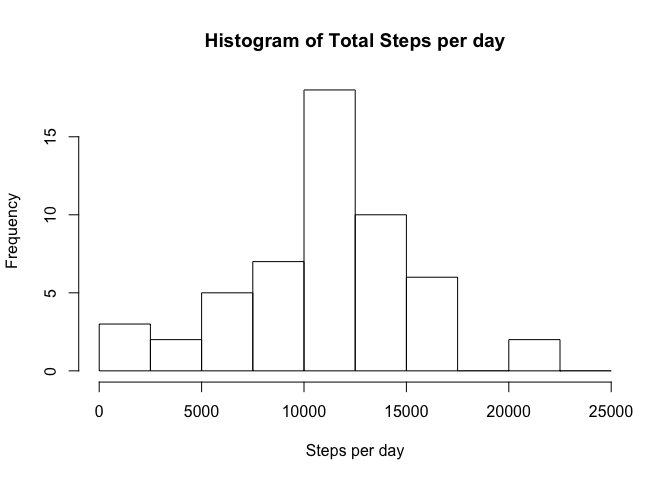
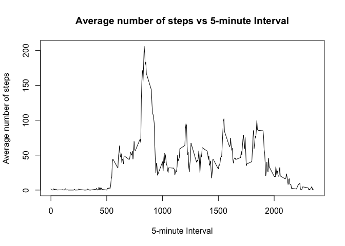
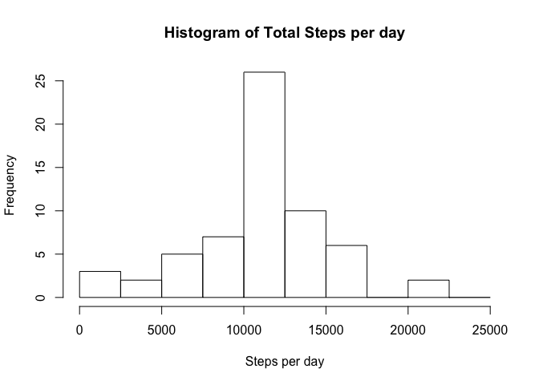
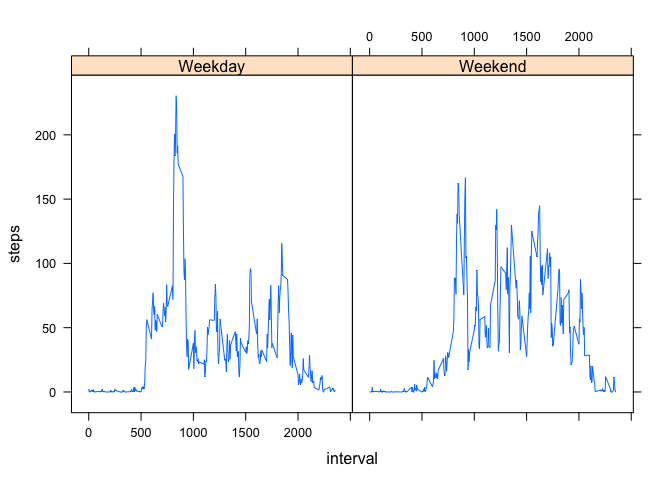

# Reproducible Research: Peer Assessment 1

<!-- Load libraries that the code depends on. -->


## Introduction
It is now possible to collect a large amount of data about personal movement using activity monitoring devices such as a Fitbit, Nike Fuelband, or Jawbone Up. These type of devices are part of the “quantified self” movement – a group of enthusiasts who take measurements about themselves regularly to improve their health, to find patterns in their behavior, or because they are tech geeks. But these data remain under-utilized both because the raw data are hard to obtain and there is a lack of statistical methods and software for processing and interpreting the data.

This report makes use of data from a personal activity monitoring device. This device collects data at 5 minute intervals through out the day. The data consists of two months of data from an anonymous individual collected during the months of October and November, 2012 and include the number of steps taken in 5 minute intervals each day.

## Loading and preprocessing the data
The data for this report is stored in the GIT repository as a zip file. The following R code is used to uncompress the zip file into a comma separated value file that can be read and loaded into R. The variables included in this dataset are:

* **steps**: Number of steps taking in a 5-minute interval (missing values are coded as NA)

* **date**: The date on which the measurement was taken in YYYY-MM-DD format

* **interval**: Identifier for the 5-minute interval in which measurement was taken

The dataset is stored in a comma-separated-value (CSV) file and there are a total of 17,568 observations in the dataset. The data is read into a full data frame and a clean data frame that has all of the NA values removed. Note that the date field is converted from a string to a Date object.


```r
zipFileName <- "activity.zip"
csvFileName <- "activity.csv"
fullDf <- data.frame()
cleanDf <- data.frame()

if(!file.exists(csvFileName) && file.exists(zipFileName))
{
    unzip(zipFileName)
}

if(file.exists(csvFileName))
{
    fullDf <- read.csv("activity.csv", stringsAsFactors=FALSE)
    fullDf$date <- as.Date(fullDf$date, format="%Y-%m-%d")
    cleanDf <- fullDf[!is.na(fullDf$steps), ]
} else {
    print("Error: cannot read csv file=activity.csv")
}
```

## What is mean total number of steps taken per day?
To calcuate the total steps taken per day, the aggregate() method was used to sum the steps by the date. This calculation results iin a dataframe with two columns representing the data and total number of steps on that date.


```r
aggdata <- aggregate(cleanDf$steps, by=list(cleanDf$date), FUN=sum)
```

Next we make a histogram of the data from above to show the relative level of activity per day. This plot is useful for showing the magnitude of difference between days with many steps and days with few steps (indicating a low level of activity).


```r
hist(aggdata$x, xlab="Steps per day", main="Histogram of Total Steps per day", breaks=c(0,2500,5000,7500,10000,12500,15000,17500,20000,22500,25000))
```

 

Next we compute the average of the total number of steps taken per day: 


```r
cleanMean <- mean(aggdata$x)
print(sprintf("The mean number of steps for the cleaned data set is: %f", cleanMean))
```

```
## [1] "The mean number of steps for the cleaned data set is: 10766.188679"
```

Finally we compute the median of the total number of steps taken per day:


```r
cleanMedian <- median(aggdata$x)
print(sprintf("The median number of steps for the cleaned data set is: %f", cleanMedian))
```

```
## [1] "The median number of steps for the cleaned data set is: 10765.000000"
```

## What is the average daily activity pattern?
For this question we examine the activities across each 5-minute interval within the dataset rather than the day. First we some all of the data across each 5-minute interval using the aggragate() method. Then we make a plot of the 5-minute interval against the average number of steps taken in that interval.

```r
aggdata <- aggregate(cleanDf$steps, by=list(cleanDf$interval), FUN=mean)
names(aggdata) <- c("interval", "mean.steps")
plot(aggdata[,1], aggdata[,2], type="l", xlab="5-minute Interval", ylab="Average number of steps", main="Average number of steps vs 5-minute Interval")
```

 

We use this value to determine the maximum average number of steps taken over any of the 5-minute intervals.

```r
maxrow <- aggdata[aggdata$mean.steps == max(aggdata[,2]), ]
interval <- maxrow[1]$interval
mean.steps <- maxrow[2]$mean.steps
print(sprintf("The maximum average number of steps is %f taken during interval %d", mean.steps, interval))
```

```
## [1] "The maximum average number of steps is 206.169811 taken during interval 835"
```

## Imputing missing values
Note that there are a number of days/intervals where there are missing values (coded as NA). The presence of missing days may introduce bias into some calculations or summaries of the data.


```r
totalRows <- dim(fullDf)[1]
totalNAs <- length(which(is.na(fullDf$steps)))
percentNAs = 100 *(totalNAs / totalRows)
print(sprintf("Total Rows: %d ; NA Rows: %d ; Percent NA: %f percent", totalRows, totalNAs, percentNAs))
```

```
## [1] "Total Rows: 17568 ; NA Rows: 2304 ; Percent NA: 13.114754 percent"
```

The strategy used for filling in the missing data in the full dataset is to calculate the average for each 5-minute interval on the cleaned data (ie; with the NA values removed) and setting the values in the full dataset to the the appropriate average value. I could not figure out a nice way to do this with an apply method so a for loop was used.


```r
aggdata <- aggregate(cleanDf$steps, by=list(cleanDf$interval), FUN=mean)
normDf <- fullDf
for(i in 1:dim(normDf)[1])
{
    if(is.na(normDf[i, "steps"]))
    {
        normDf[i, "steps"] <- aggdata[aggdata$Group.1 == normDf[i, "interval"], ][2]
    }
}
```

This histogram shows the relative level of activity per day using the normalized data. This plot is useful for showing the magnitude of difference between days with many steps and days with few steps (indicating a low level of activity). There seems to be very little difference between the normalized data and the scrubbed data.

```r
aggdata <- aggregate(normDf$steps, by=list(normDf$date), FUN=sum)
hist(aggdata$x, xlab="Steps per day", main="Histogram of Total Steps per day", breaks=c(0,2500,5000,7500,10000,12500,15000,17500,20000,22500,25000))
```

 

Next we calculate the mean of the number of steps per day using the normalized data and again find very little difference with the value calculated for the scrubbed clean data.

```r
normMean <- mean(aggdata$x)
percentChange <- 100.0 * ((normMean - cleanMean)/cleanMean)
print(sprintf("The mean number of steps for the normalized data set is: %f, the mean for the cleaned data set is: %f, the percent chage is: %f", normMean, cleanMean, percentChange))
```

```
## [1] "The mean number of steps for the normalized data set is: 10766.188679, the mean for the cleaned data set is: 10766.188679, the percent chage is: 0.000000"
```

Finally we calculate the median of the number of steps per day using the normalized data and again find very little difference with the value calculated for the scrubbed clean data.

```r
normMedian <- median(aggdata$x)
percentChange <- 100.0 * ((normMedian - cleanMedian)/cleanMedian)
print(sprintf("The mean number of steps for the normalized data set is: %f, the mean for the cleaned data set is: %f, the percent chage is: %f", normMedian, cleanMedian, percentChange))
```

```
## [1] "The mean number of steps for the normalized data set is: 10766.188679, the mean for the cleaned data set is: 10765.000000, the percent chage is: 0.011042"
```

## Are there differences in activity patterns between weekdays and weekends?
First, a new character string variable was created in the dataset specifying the day of the week, then a new factor variable was created based on that with two levels – “weekday” and “weekend” indicating whether a given date is a weekday or weekend day.

```r
normDf["wday"] <- weekdays(normDf$date, abbreviate=TRUE)
normDf <- mutate(normDf, is.weekday = ifelse(wday == "Sat" | wday == "Sun", "Weekend", "Weekday"))
normDf$is.weekday <- as.factor(normDf$is.weekday)
```

That factor variable was then used to make a panel plot containing a time series plot (i.e. type = "l") of the 5-minute interval (x-axis) and the average number of steps taken, averaged across all weekday days or weekend days (y-axis).

```r
aggdata <- aggregate(normDf$steps, by=list(normDf$interval, normDf$is.weekday), FUN=mean)
names(aggdata) <- c("interval", "is.weekday", "steps")
xyplot(steps~interval | is.weekday, aggdata, type="l", horizontal=TRUE)
```

 

The plot seems to indicate that more activity occurs on the weekend but it is not as clear cut as you might want To get a clearer picture, the mean and median number of steps need to be calculated for the weekday and weekends.


```r
mean.weekday <- mean(aggdata[aggdata$is.weekday == "Weekday", ]$steps)
median.weekday <- median(aggdata[aggdata$is.weekday == "Weekday", ]$steps)
mean.weekend <- mean(aggdata[aggdata$is.weekday == "Weekend", ]$steps)
median.weekend <- median(aggdata[aggdata$is.weekday == "Weekend", ]$steps)

print(sprintf("The average number of steps on a weekday is: %f ; on the weekend is: %f", mean.weekday, mean.weekend))
```

```
## [1] "The average number of steps on a weekday is: 35.610581 ; on the weekend is: 42.366401"
```

```r
print(sprintf("The median number of steps on a weekday is: %f ; on the weekend is: %f", median.weekday, median.weekend))
```

```
## [1] "The median number of steps on a weekday is: 25.803145 ; on the weekend is: 32.339623"
```

The conclusion from this is that there is definitely more activity on weekends. Both the mean and median values are higher on the weekend.


```r
percent.mean = 100.0 * ((mean.weekend - mean.weekday) / mean.weekday)
percent.median = 100.0 * ((median.weekend - median.weekday) / median.weekday)

print(sprintf("The mean number of steps %f percent higher on weekends ; the median number of steps is %f percent higher on weekends", percent.mean, percent.median))
```

```
## [1] "The mean number of steps 18.971384 percent higher on weekends ; the median number of steps is 25.332098 percent higher on weekends"
```
